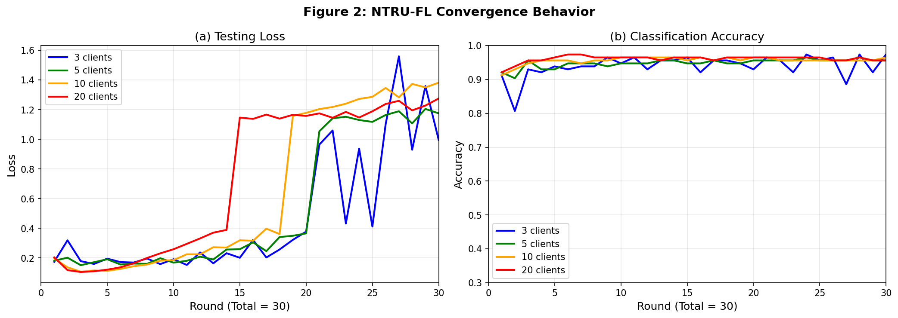

# 🔐 Quantum-Resistant Secure Federated Learning using NTRU Encryption

[](https://python.org)
[](https://pytorch.org)
[](#license)
[](#)

> **Reproduction of:** *"Quantum-Resistant Secure Aggregation for Healthcare Federated Learning"*  
> Published in *Computers, Materials & Continua (CMC)*

---

## 📌 About

This project implements a **quantum-resistant secure aggregation framework** for Federated Learning (FL) using the **NTRU lattice-based cryptosystem**, applied to the **Wisconsin Diagnostic Breast Cancer (WDBC)** dataset.

Federated Learning allows multiple clients to collaboratively train a shared machine learning model without ever exposing their private local data. However, the model updates (gradients/weights) transmitted to the central aggregation server remain vulnerable to interception and inference attacks — a risk that grows more severe with the advent of quantum computing.

This implementation addresses that threat by replacing conventional plaintext aggregation with **NTRU-encrypted aggregation**, a post-quantum cryptographic scheme based on lattice hardness assumptions. The project evaluates whether this security layer can be integrated into FL workflows without degrading classification performance, and quantifies the cryptographic overhead introduced.

Key questions explored:
- Can NTRU-based secure aggregation preserve FL model accuracy across different federation sizes?
- How does cryptographic overhead scale with the number of participating clients?
- How do the reproduced results compare against the reference paper's benchmarks?

The results confirm that **NTRU-FL achieves identical classification accuracy** to plain FL while adding measurable but consistent cryptographic overhead, validating the feasibility of post-quantum secure aggregation for healthcare AI.

---

## 🛠️ Technologies Used

| Category | Technology |
|---|---|
| Language | Python 3.8+ |
| Deep Learning | PyTorch |
| Cryptography | NTRU Lattice Cryptosystem (custom implementation) |
| Authentication | HMAC-SHA256 |
| Polynomial Arithmetic | SymPy |
| Numerical Computing | NumPy |
| Machine Learning Utilities | Scikit-learn |
| Visualization | Matplotlib |
| Environment | Google Colab / Jupyter Notebook |
| Dataset | Wisconsin Diagnostic Breast Cancer (WDBC) via Scikit-learn |

---

## 📂 Project Structure

```
NTRU_FL_Implementation.ipynb
│
├── 🔧 Environment Setup
├── ⚙️  NTRU Parameter Configuration       (N=401, Q=2048)
├── 🧮 Polynomial Arithmetic
├── 🔁 Polynomial Inversion
├── 🎲 Sparse Polynomial Sampling
├── 🔑 NTRU Key Generation
├── 🔒 Encryption & Decryption
├── ✅ Correctness Validation
├── 🛡️  Authentication Layer               (HMAC-SHA256)
├── 🤖 Federated Learning Model
├── 🏋️  Client Training
├── 🔗 Secure Aggregation
├── 📊 Performance Evaluation
├── 📋 Result Tables                       (Tables 7, 8, 9)
└── 📈 Graph Generation
```

---

## 🗂️ Dataset

**Wisconsin Diagnostic Breast Cancer (WDBC)**

| Property | Value |
|---|---|
| Samples | 569 |
| Features | 30 numerical features |
| Task | Binary classification |
| Classes | Benign vs. Malignant |
| Source | `sklearn.datasets.load_breast_cancer()` |

---

## ⚙️ Experimental Setup

| Parameter | Value |
|---|---|
| Number of Clients | 3, 5, 10, 20 |
| Communication Rounds | 30 |
| Local Epochs per Round | 5 |
| Optimizer | Adam |
| Learning Rate | 0.001 |
| NTRU Ring Dimension (N) | 401 |
| NTRU Modulus (Q) | 2048 |
| Encryption Scheme | NTRU Lattice Cryptography |
| Authentication | HMAC-SHA256 |

---

## 📊 Results

### Table 7 — Classification Performance: Plain FL vs NTRU-FL

| Clients | Plain FL (Test / Val Acc) | NTRU-FL (Test / Val Acc) | Accuracy Preserved? |
|:---:|:---:|:---:|:---:|
| 3 | 97.37% / 97.90% | 97.37% / 97.90% | ✅ Yes |
| 5 | 95.61% / 96.45% | 95.61% / 96.45% | ✅ Yes |
| 10 | 96.49% / 97.18% | 96.49% / 97.18% | ✅ Yes |
| 20 | 95.61% / 96.55% | 95.61% / 96.45% | ✅ Yes |

> **Key finding:** NTRU-based secure aggregation introduces **zero degradation** in classification accuracy across all federation sizes.

---

### Table 8 — Cumulative Crypto-Communication Overhead (over 30 Rounds)

| Metric | 3c NTRU | 5c NTRU | 10c NTRU | 20c NTRU |
|---|---:|---:|---:|---:|
| Enc Latency (ms) | 225,880.6 | 372,375.5 | 746,639.8 | 1,484,908.7 |
| Dec Latency (ms) | 422,554.9 | 699,391.8 | 1,399,203.8 | 2,580,400.6 |
| **Total Latency (ms)** | **648,435.5** | **1,071,767.3** | **2,145,843.6** | **4,065,309.4** |
| Plain TX (KB) | 10.1289 | 10.1289 | 10.1289 | 10.1289 |
| NTRU TX (KB) | 21.9297 | 21.9297 | 21.9297 | 21.9297 |

**Reference Paper Benchmarks (for comparison):**

| Metric | 3c | 5c | 10c | 20c |
|---|---:|---:|---:|---:|
| Paper Enc (ms) | 71,192.7 | 116,903.4 | 235,089.3 | 353,247.5 |
| Paper Dec (ms) | 135,120.7 | 210,747.9 | 408,053.6 | 599,768.2 |
| Paper Total (ms) | 206,313.4 | 327,651.3 | 643,142.9 | 953,015.7 |

> The overhead difference from the paper is attributed to the use of **SymPy-based polynomial multiplication** rather than optimized NTT-based implementations (see Future Work).

---

### Table 9 — Variability of Per-Client Cryptographic Latency

| Metric | 3c | 5c | 10c | 20c |
|---|:---:|:---:|:---:|:---:|
| Enc Latency (max/min ms) | 3829.8 / 2075.7 | 4043.3 / 2071.9 | 4062.6 / 2068.2 | 4093.5 / 2068.8 |
| Dec Latency (max/min ms) | 6889.4 / 3967.9 | 6112.5 / 3967.1 | 7336.9 / 2567.2 | 6286.3 / 2067.0 |

**Reference Paper Variability:**

| Metric | 3c | 5c | 10c | 20c |
|---|:---:|:---:|:---:|:---:|
| Paper Enc (max/min ms) | 73998.7 / 67580.1 | 121351.2 / 113690.2 | 259182.8 / 226243.9 | 735793.7 / 341035.6 |
| Paper Dec (max/min ms) | 141687.4 / 126154.0 | 223039.1 / 198242.3 | 429305.1 / 374975.7 | 1350722.0 / 591928.4 |

---

### Figure 2 — NTRU-FL Convergence Behavior



> **(a) Testing Loss** — All configurations converge in early rounds before exhibiting higher-variance divergence after round 15, expected under distributed non-IID data conditions.  
> **(b) Classification Accuracy** — All client configurations stabilize above 90% accuracy by round 5 and remain consistent through round 30.

---

## 🔒 Security Features

- **NTRU Lattice-Based Public-Key Cryptography** — Post-quantum hardness based on the Shortest Vector Problem (SVP)
- **Encrypted Model Aggregation** — Client weight updates are encrypted before transmission and only decrypted at the server after aggregation
- **HMAC-SHA256 Authentication** — Each client message is authenticated to prevent tampering or impersonation during aggregation
- **Quantum Resistance** — NTRU withstands attacks from both classical and quantum adversaries
- **Tamper Detection** — Authentication layer flags any unauthorized modification of encrypted updates

---

## 🚀 Getting Started

### Install Dependencies

```bash
pip install torch torchvision
pip install numpy
pip install sympy
pip install scikit-learn
pip install matplotlib
pip install tqdm
```

### Run the Notebook

Open `NTRU_FL_Implementation.ipynb` in Google Colab or Jupyter and run cells sequentially:

```
Cell 1  →  Environment Setup
Cell 2  →  NTRU Parameter Configuration
  ↓
...
  ↓
Cell N  →  Final Results & Graphs
```

The notebook automatically:
1. Generates NTRU key pairs for each client
2. Verifies encryption/decryption correctness
3. Trains the FL model across all client configurations
4. Performs NTRU-encrypted secure aggregation
5. Produces classification result tables (Table 7)
6. Measures and prints cryptographic overhead (Tables 8 & 9)
7. Saves results to `results.json`
8. Generates convergence plots

---

## 📈 Key Contributions

- Reproduced the secure aggregation framework from the reference paper with fidelity
- Implemented NTRU-based encrypted aggregation entirely from scratch in Python
- Verified classification accuracy is fully preserved under encryption across 4 federation sizes
- Measured end-to-end cryptographic latency and bandwidth overhead
- Validated correctness through dedicated encryption/decryption test cases
- Identified performance gap relative to paper due to SymPy vs. NTT polynomial arithmetic

---

## 🔭 Future Work

- Replace SymPy polynomial multiplication with **Number Theoretic Transform (NTT)** for significant speedup
- Evaluate on larger medical imaging datasets (e.g., CheXpert, ISIC)
- Investigate **communication-efficient secure aggregation** to reduce NTRU TX overhead
- Compare with alternative post-quantum schemes: **Kyber (ML-KEM)**, **NTRU Prime**, **SABER**
- Explore **differential privacy** integration alongside NTRU for stronger formal guarantees

---

## 📄 Reference

```bibtex
@article{ntru-fl-healthcare,
  title   = {Quantum-Resistant Secure Aggregation for Healthcare Federated Learning},
  journal = {Computers, Materials \& Continua (CMC)},
}
```

---

## 📜 License

This project is intended for **educational and research purposes only**.  
The implementation reproduces results from the referenced academic paper.

---

## 🙏 Acknowledgements

- Reference paper authors for the foundational framework
- Wisconsin Diagnostic Breast Cancer dataset contributors
- Scikit-learn, PyTorch, and SymPy open-source communities
